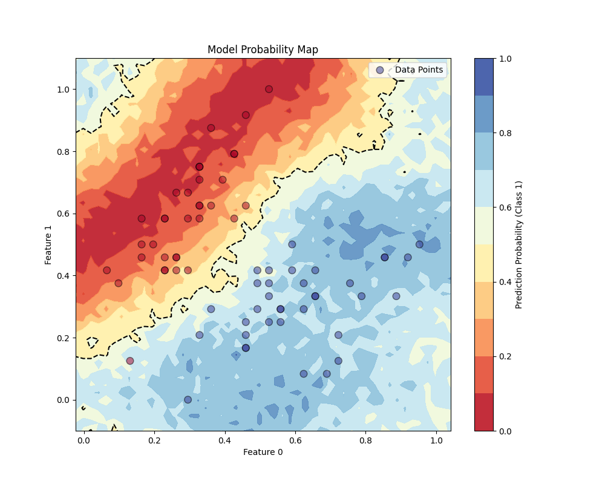

## README to Come soon# Project 2: Quantum Machine Learning



*Figure: Quantum Machine Learning workflow showing the integration of classical data encoding, parameterized quantum circuits, and classical optimization.*

This project implements a quantum machine learning framework for binary classification using parameterized quantum circuits (PQCs). The implementation includes various quantum data encoders, ansatzes, and optimizers for training quantum classifiers.

## Features

- **Quantum Data Encoders**: Map classical data to quantum states
  - [`AngleEncoder`](qml/encoders.py): Basic angle encoding
  - [`HadRotZRotZZEncoder`](qml/encoders.py): Advanced encoding with Hadamard and rotation gates
- **Parameterized Quantum Ansatzes**: Trainable quantum circuits
  - [`SimpleAnsatz`](qml/ansatzes.py): Basic parameterized circuit
  - [`AdvancedAnsatz`](qml/ansatzes.py): Multi-layer ansatz with entangling gates
- **Quantum Optimizers**: Parameter optimization using quantum-aware methods
  - [`AdamOptimizer`](qml/optimizers.py): Adam optimizer with parameter shift rule
- **Data Visualization**: Tools for visualizing quantum model performance
  - Training data visualization
  - Decision boundary plotting
  - Training history tracking

## Project Structure

```
quantum_computing/p2/
├── __init__.py              # Package initialization
├── __main__.py              # Main execution script
├── README.md                # This file
├── qml/                     # Quantum ML core package
│   ├── __init__.py          # QML package exports
│   ├── quantum_model.py     # Main QuantumClassifier implementation
│   ├── encoders.py          # Data encoding strategies
│   ├── ansatzes.py          # Parameterized quantum circuits
│   ├── optimizers.py        # Quantum-aware optimizers
│   └── initializers.py      # Parameter initialization
└── utils/                   # Utility functions
    ├── data_prepperation.py  # Data loading and preprocessing
    └── visualization.py      # Plotting and visualization tools
```

## Installation

This project is managed using [Poetry](https://python-poetry.org/). The dependencies are defined in the [`pyproject.toml`](../../pyproject.toml) file.

### Prerequisites

- Python >= 3.12, < 4.0
- Poetry (recommended) or pip

### Option 1: Using Poetry (Recommended)

1. Install Poetry if you haven't already:
```bash
curl -sSL https://install.python-poetry.org | python3 -
```

2. Clone the repository and navigate to the project root:
```bash
git clone <repository-url>
cd quantum-computing
```

3. Install dependencies using Poetry:
```bash
poetry install
```

4. Activate the virtual environment:
```bash
poetry shell
```

### Option 2: Using pip (Local Installation)

1. Navigate to the project root directory
2. Install the package in editable mode:
```bash
pip install -e .
```

This will install all required dependencies including:
- `qiskit>=2.0.1,<3.0.0`
- `qiskit-aer>=0.17.0,<0.18.0`
- `numpy>=2.2.2,<3.0.0`
- `matplotlib>=3.10.0,<4.0.0`
- `scikit-learn>=1.6.1,<2.0.0`
- `pandas>=2.2.3,<3.0.0`
- `seaborn>=0.13.2,<0.14.0`

## Usage

### Quick Start

Run the main script with default parameters:
```bash
# Using Poetry
poetry run python -m quantum_computing.p2

# Using pip installation
python -m quantum_computing.p2
```

### Command Line Arguments

The main script supports various configuration options:

#### Data Configuration
- `--n-features INT`: Number of features to use (default: 2)
- `--test-size FLOAT`: Test set size ratio (default: 0.3)

#### Model Configuration
- `--num-qubits INT`: Number of qubits (default: 2)
- `--num-layers INT`: Number of ansatz layers (default: 2)
- `--measurement-qubit INT`: Qubit to measure (default: 0)
- `--shots INT`: Number of shots for measurement (default: 100)

#### Training Configuration
- `--learning-rate FLOAT`: Learning rate for optimizer (default: 0.7)
- `--epochs INT`: Number of training epochs (default: 70)
- `--batch-size INT`: Batch size for training (default: 16)

#### Visualization Options
- `--no-plots`: Disable plot visualization
- `--save-plots`: Save plots to files instead of showing
- `--seed INT`: Random seed (default: 42)

### Example Usage

Train a quantum classifier with custom parameters:
```bash
python -m quantum_computing.p2 --num-qubits 3 --num-layers 3 --epochs 100 --learning-rate 0.5
```

Save plots instead of displaying them:
```bash
python -m quantum_computing.p2 --save-plots
```

Run with Poetry:
```bash
poetry run python -m quantum_computing.p2 --num-qubits 2 --epochs 50 --save-plots
```

### Programmatic Usage

You can also use the quantum ML components directly in your code:

```python
from quantum_computing.p2.qml import QuantumClassifier, AngleEncoder, SimpleAnsatz, AdamOptimizer
from quantum_computing.p2.utils.data_prepperation import load_iris_binary, preprocess_data

# Load and preprocess data
X, y = load_iris_binary()
X_train, X_test, y_train, y_test = preprocess_data(X, y, n_features=2)

# Create quantum model
model = QuantumClassifier(
    num_qubits=2,
    encoder=AngleEncoder(),
    ansatz=SimpleAnsatz(),
    optimizer=AdamOptimizer(learning_rate=0.7),
    measurement_qubit=0,
    shots=100
)

# Train the model
history = model.train(X_train, y_train, epochs=50, batch_size=16)

# Make predictions
predictions = model.predict(X_test)
```

## Model Architecture

The [`QuantumClassifier`](qml/quantum_model.py) implements a hybrid classical-quantum approach:

1. **Data Encoding**: Classical data is encoded into quantum states using various encoding strategies
2. **Parameterized Circuit**: A trainable quantum circuit (ansatz) processes the encoded data
3. **Measurement**: The output qubit is measured to obtain classification probabilities
4. **Optimization**: Classical optimizer updates quantum parameters using gradient information

## Results

The framework generates several visualizations:
- Training data scatter plots
- Training history (loss and accuracy curves)
- Quantum decision boundary visualization
- Probability map showing model predictions across the feature space

Example output files:
- `training_data.png`: Visualization of the training dataset
- `training_history.png`: Training metrics over epochs
- `probability_map.png`: Decision boundary and probability landscape

## Development

For development work:

```bash
# Install with development dependencies
poetry install --with dev

# Run tests (if available)
poetry run pytest

# Format code
poetry run black quantum_computing/p2/

# Lint code
poetry run flake8 quantum_computing/p2/
```

## Implementation Details

- Uses Qiskit for quantum circuit simulation
- Implements parameter shift rule for gradient computation
- Supports both validation and training metrics tracking
- Includes circuit depth analysis and visualization tools
- Modular design allows easy swapping of encoders, ansatzes, and optimizers

## Performance

The quantum classifier is tested on the Iris dataset (binary classification) and achieves competitive performance with classical methods while demonstrating quantum machine learning concepts.

## Contributing

This is an academic project for the FYS5419 Quantum Computing course. The implementation focuses on educational purposes and demonstrating quantum ML principles.

## Related Projects

This project is part of a larger quantum computing course project. See also:
- [Project 1](../p1/): Quantum algorithms and VQE implementation
- [Main README](../../README.md): Overview of the entire quantum computing repository